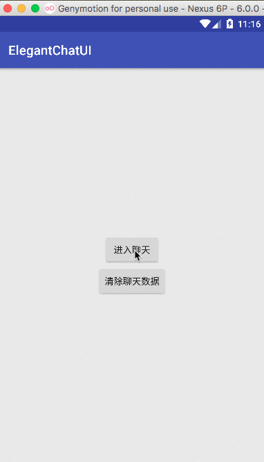

# ElegantChatUI

##利用RecyclerView和SwipeRefreshLayout的特性,打造一款流畅的聊天UI（kotlin编程）。

  - 上拉可以加载更多历史消息，数据库方面使用了GreenDao 3.2
  - 问题：因为利用了RecyclerView的reverselayout=true，翻转了列表，所以当数据少于一屏时，
    数据会在屏幕最下面。如果有好的解决方案，请私信我。

  | Preview                        |
  |:------------------------------:|
  |       |

##Download

  

